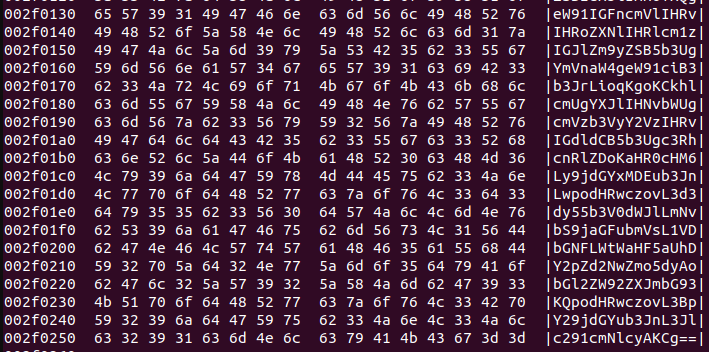
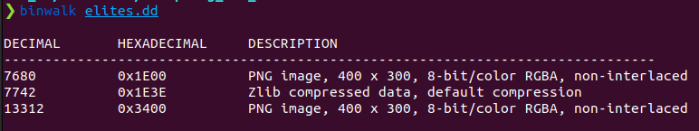
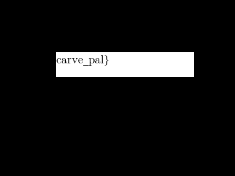
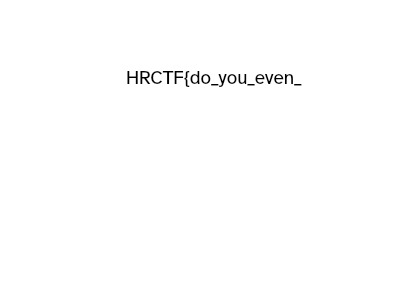
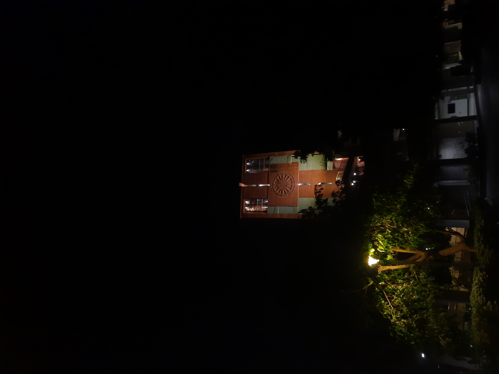

# Cyber Security: HackRushCTF'24

### Reverse Engineering
- __Tour de files__

It was a really interesting problem. Firstly, we used the string command ```strings flracing > info.txt``` and looked for the flag in the txt file. Nothing was found inside it except "better luck next time". Then we used reverse engineering tools such as hopper in a hope that the flag would be present near one of the lines where malloc would be used. Unfortunately, there was no such statement in the main block. After not getting any fruitful results we just executed the file, a message appeared "file unchanged. Good luck next time kiddo!". Then we thought of changing the input file while executing the given file. So, in one terminal we run a for loop
```sh
while true; do
    echo "hrctf" >> dummy.txt
done
```
and in the other terminal we run the given file.
```sh
./flracing dummy.txt
```
By, doing this it gave the flag.

```sh
FLAG: HR24{0383d4bd9ad8ddfc53c24aa6c4bdbc8a}
```

### Forensics
- __More than Meets the Eye__
As, this problem comes under forensics the first thing that we did was to use binwalk to confirm wheather any file was embeded in it. We noticed one png, two zlib compressed files, and one MySQL MISAM compressed data. Upon searching a little bit we found out that the MySQL is a false signature. We also looked for a similar png file in the web and compared it to see if the pixel values were changed but there was nothing. So, then we looked for the hexdump and noticed that the end part of it was filled with characters. The character set contains A-Z, a-z, 0-9, and == at the end indicating that it is base64 encoded. Then we proceeded to create a python file to decode the base64 encoding.

```sh
FLAG: HRCTF{H1D1n9_fl495_1n_1nn0V471v3_w4Y2}
```
- __Sculpting for noobs__
Similar to the previous problem we used the linux _hexdump_ command to look for the flag but it didn't worked. Then we used _binwalk_ to look for hidden files. we noticed 2 png files. 

Upon extracting it using ```binwalk -e elites.dd``` nothing interested was found. After trying for sometime we used _photrec_ to recover the images. But the image was partially restored showing the end part of it.

 We then observed that the hexdump of it contains two PNG keyword and two IEND keyword but the only problem was that the 2nd IEND was before the 2nd PNG. Therefore, the problem became a piece of puzzle where we need to rearrange it. We wrote a python script that would do that but there was one problem the starting and ending signature of the png files were jumbled up. We also, tried to retrive the data backwards but it didn't work. Lastly we found one reseach paper and from there we traced the links to find the github repo containing the code. After executing it we found the another part of the flag.
 

repo [link](https://github.com/fkie-cad/png-carving)
```sh
 FLAG: HRCTF{do_you_even_carve_pal}
```
### OSINT
- __GeoGuessr Flags__
A image was given and the flag was about coordinates. So, we searched it in google lens and found out that it is the Red Square in Moscow, Russia. We pin pointed the exact [location](https://www.google.com/maps/@55.7542066,37.6194264,3a,75y,108.86h,95.79t/data=!3m6!1e1!3m4!1sD6O09ioTLaeO0v2k5GeFlw!2e0!7i13312!8i6656?entry=ttu), the coordinates were 55.754,37.619 but it didn't worked. Then we started looking for the nearby landmarks in the area in google.
```sh
FLAG: HRCTF{55.753,37.619}
```

- __Where's Spidey?__
On visiting the given account, somewhere inbetween there was a mention of stackoverflow about how to download the original files. Just right after it another post was there which was edited. We looked at the initial post and got to know that a photo was uploaded about lal minar on google maps. We searched for the leatest one, the date on it shows the month and the year only. Therefore, the previous post was a hint to download the original image. From there we found this [link](https://stackoverflow.com/questions/54782846/how-to-download-an-original-image-or-video-with-the-baseurl-of-google-photos-api) which talks about downloading the original image. We added the -d at the end of the URL as directed and was able to download and retrieve the date-time format.



```sh
FLAG: HRCTF{230803-221004}
```

### Binary Exploitation
- __Broken down__
On unziping the given zip file, around 1400 binary files emerged. So, one of the methods that we employed was to combine all the files into one using python and then look for the flag. Another, method that we covered was to use linux _strings_ command on the directory. ```strings * > info.txt``` dumped all the printable characters in a text file and then we looked for the flag in the text file.
```sh
FLAG: HRCTF{7h15_15_63771n6_r3p17171v3}
```
- __Le chiffrage indéchiffrable__
Three things were given the programs output, llv, and a assembly file. We proceeded to convert the assembly file to its corresponding C files. Upon inspection a key was found. After brainstorming a little bit we searched the problem's name and found out that it is related to the indecipherable cipher, and the output is the encrypted text that is given. The key given in the assembly file was ```"LEARNINGISFUN"``` but the actual key was in the starting of .ll file ```hrcybersecctf```. We did brute force to find the flag that was taken as input from Flag.txt and then noticed that the initial key was a hint towards the actual flag value.

```sh
FLAG: HRCTF{7h15_0n3_1_h0p3_w45_fun}
```

### Misc
- __An Easy One__
As the name suggest this one is actually an easy one. A QR Code in which the FLAG was embeded. On scanning it, the FLAG was found.

```sh
FLAG: HRCTF{h0w_15_7h15_7h47_345y?}
```

- __Scan Me?__
This problem seemed to be same as the previous one. So, the first thing that striked was to scan it. Unfortunately, it was not a QR Code. It was a combination of B&W square. So, we thought the data was encoded inside it in the form of binary data. We wrote a python code to get the binary data and then converted to ASCII in order to look for some hints, but no luck. At the end we were unable to solve this one.